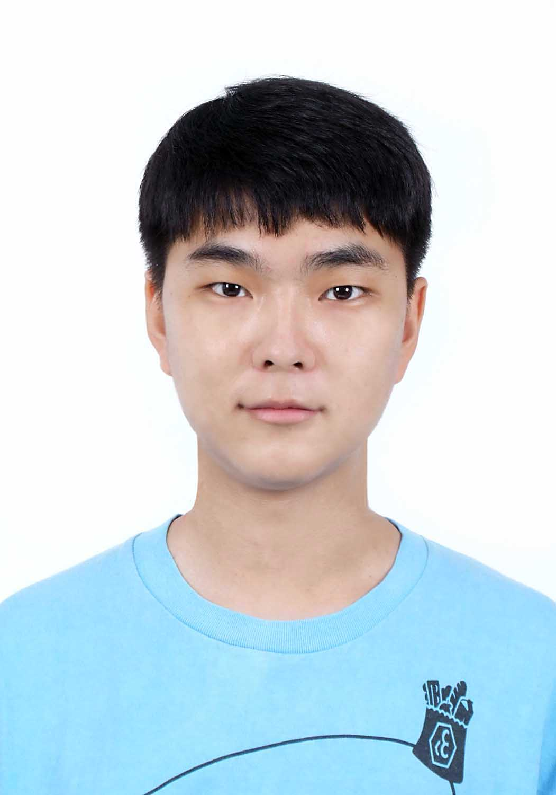

<table>
  <tr>
    <td width="25%">
      
    </td>
    <td width="75%">
      <h1>Sung Min Jeon (전성민)</h1>
      

        <strong>Undergraduate Student</strong> 
        Department of Rural Systems Engineering / Interdisciplinary Major in Artificial Intelligence 
        Seoul National University (SNU) 
        Seoul, Korea
      

      

        <strong>Contact:</strong> <a href="mailto:jsm5792@snu.ac.kr">jsm5792@snu.ac.kr</a> 
        <strong>Links:</strong> <a href="https://github.com/jsm5792">GitHub</a>
      

    </td>
  </tr>
</table>

[cite_start]I am an undergraduate student at **Seoul National University**, majoring in **Rural Systems Engineering** with an interdisciplinary major in **Artificial Intelligence** and a minor in **Electrical & Computer Engineering**[cite: 5, 6, 7].

My research interests lie in **Computer Vision, Generative AI, and Efficient Computing**. [cite_start]Specifically, I am interested in developing efficient models for mobile/edge devices and applying generative models (Stable Diffusion) for precise image editing[cite: 13, 19].

[cite_start]Previously, I worked as an undergraduate intern at the **Networked Computing Lab**, studying model binarization and mobile clustering[cite: 11, 13]. [cite_start]I also have experience in quantum computing, having implemented Renyi entropy estimation using classical shadow, which led to winning 1st place in the Quantum AI Contest[cite: 21, 23].

---

### Education

* [cite_start]**Seoul National University**, Seoul, Korea (Mar 2020 – Present) [cite: 5]
    * [cite_start]B.S. in Rural Systems Engineering [cite: 7]
    * [cite_start]Interdisciplinary Major in Artificial Intelligence [cite: 7]
    * [cite_start]Minor in Electrical & Computer Engineering [cite: 7]
* [cite_start]**Daejeon Science High School for the Gifted**, Daejeon, Korea (Mar 2017 – Feb 2020) [cite: 9]

---

### Research & Project Experience

[cite_start]**Networked Computing Lab** (Jul 2024 – Feb 2025) [cite: 11]
* *Undergraduate Intern*
* [cite_start]Conducted research on **Binarizing models**, **Mobile Clustering**, and **Preemption on Mobile Edge GPUs**[cite: 13].

[cite_start]**Generative AI Image Editing Project** (Oct 2025 – Dec 2025) [cite: 18]
* [cite_start]Developed a semantic image editing pipeline using **Stable Diffusion** for precise concept replacement while maintaining background consistency[cite: 19].
* [cite_start]Integrated **Textual Inversion with Null-text Inversion** and applied SLERP-based latent blending[cite: 20].

[cite_start]**Quantum AI Contest Project** (Jul 2025 – Aug 2025) [cite: 21]
* [cite_start]**1st Place Winner** [cite: 21]
* [cite_start]Developed a hybrid AI model for FashionMNIST classification and verified Renyi entropy estimation using **quantum circuits** and **classical shadow** techniques[cite: 22, 23].

[cite_start]**Multiphysics Structure & Systems Engineering Lab** (Dec 2023 – Mar 2024) [cite: 14]
* *Undergraduate Intern*
* [cite_start]Proposed a machine learning-based flood damage prediction model[cite: 16].

---

### Publications

* Dongwoo Lee, Mingyu Kim, Sangjun Park, **Sungmin Jeon** (2018). "Identification of the way to fold regular n-gons when n=7,13,19 and 37", *The Journal of Youths in Scientific Research*, Vol. [cite_start]3, No. 1, pp.33-54[cite: 28].

---

### Honors & Awards

* [cite_start]**1st Place**, Quantum AI Contest (2025) [cite: 21]
* [cite_start]**Sangrok Cultural Foundation Scholarship** (2025) [cite: 32]
* [cite_start]**Agricultural Engineers Scholarship** (2023, 2025) [cite: 31]
* [cite_start]**Dongwon Scholarship** (2024) [cite: 30]

---

### Activities

* [cite_start]**Mentor**, Chungbuk Science Gifted Mentoring (Information Division) (Jul 2025 – Nov 2025) [cite: 25]
    * [cite_start]Designed and taught a Machine Learning Course for gifted students[cite: 26].
